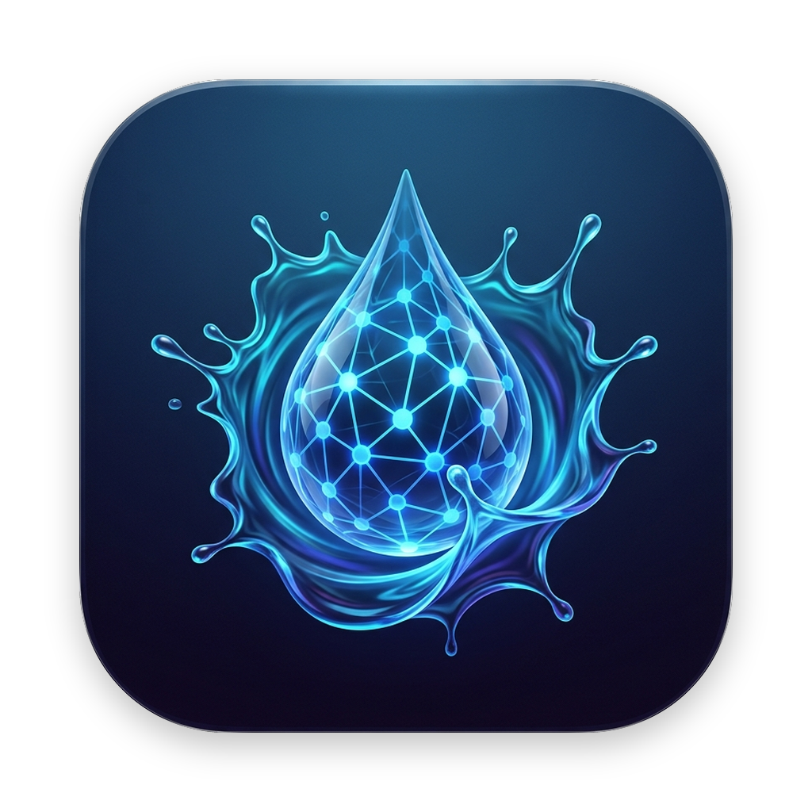
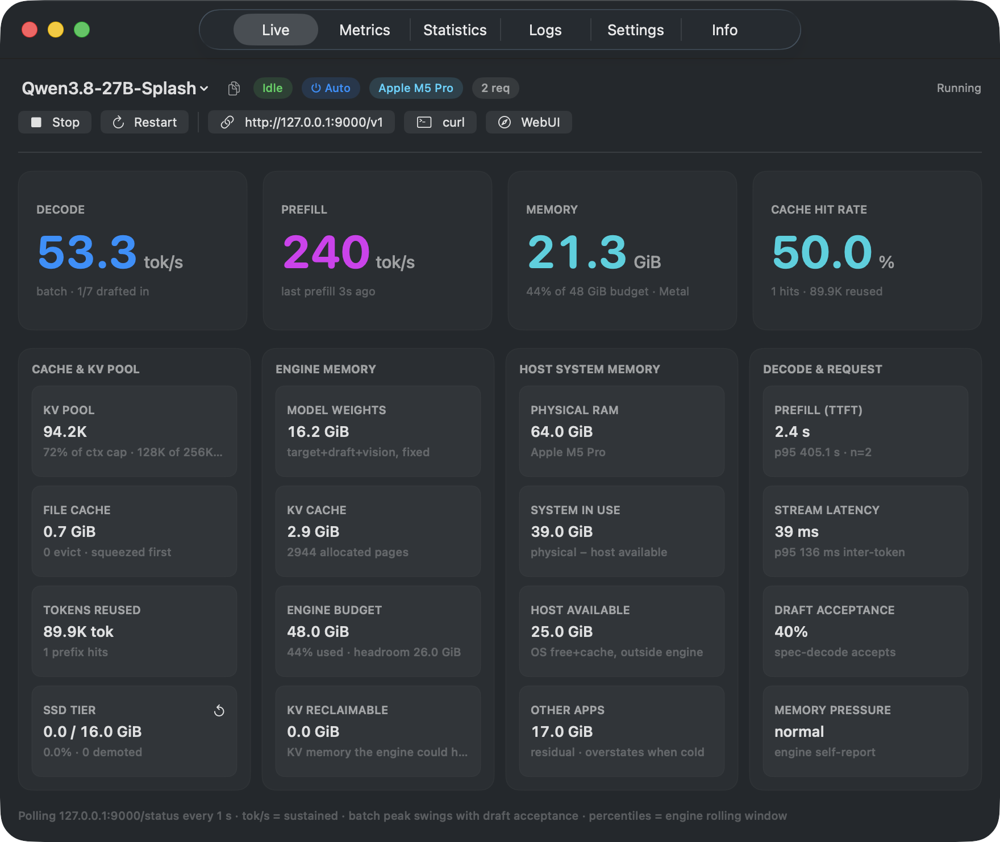
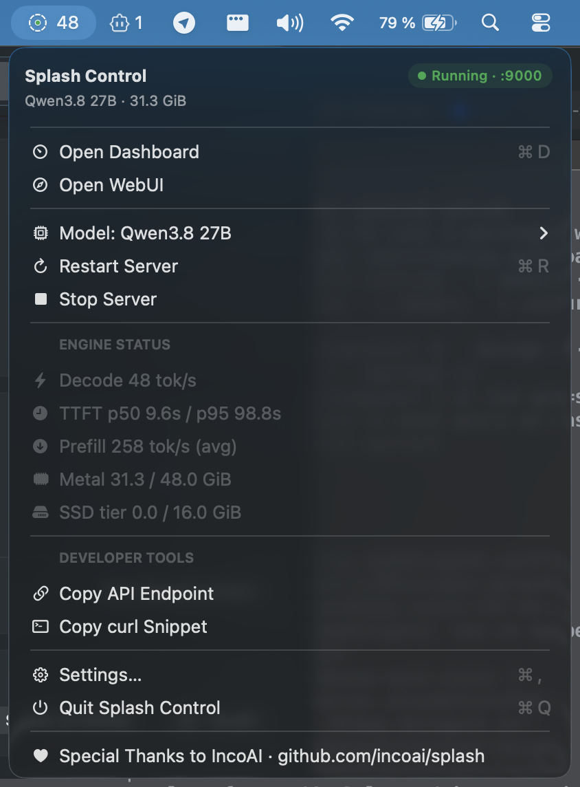
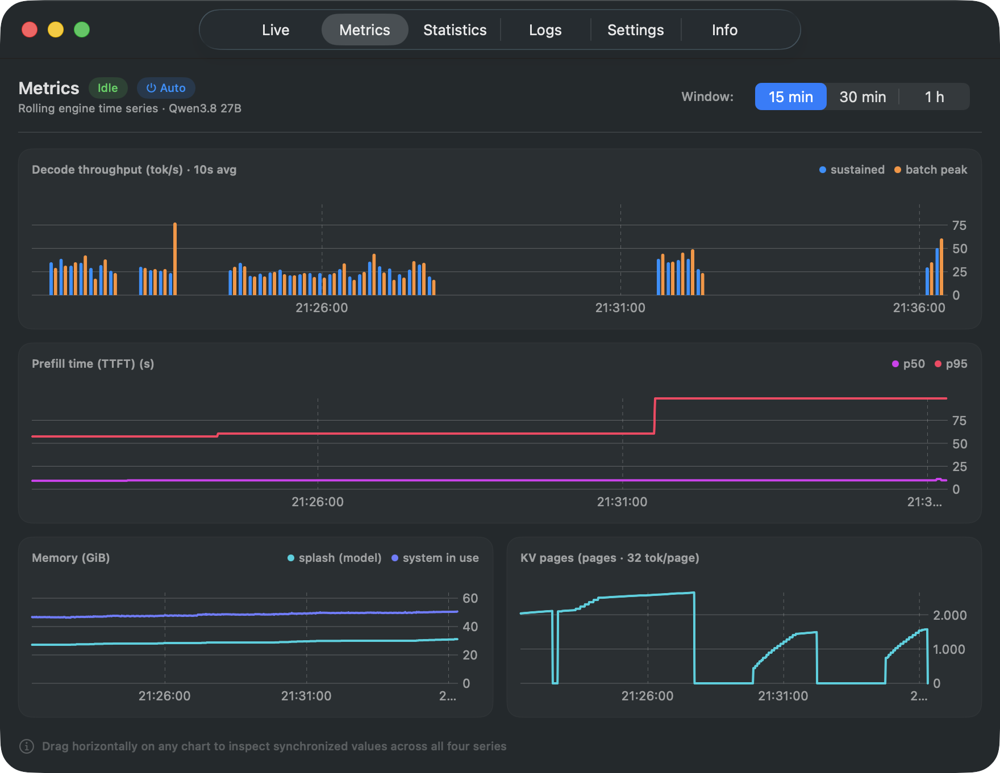
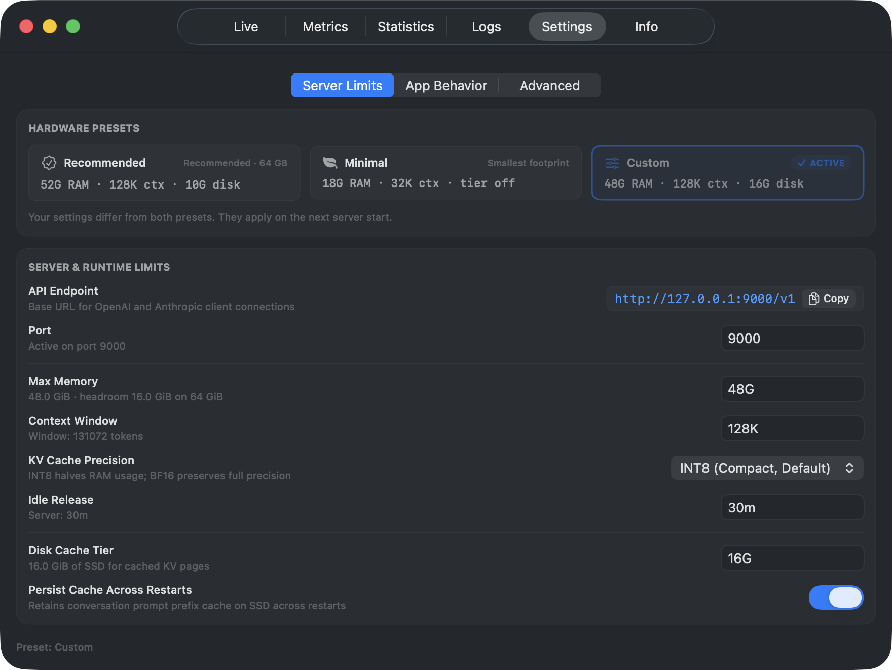
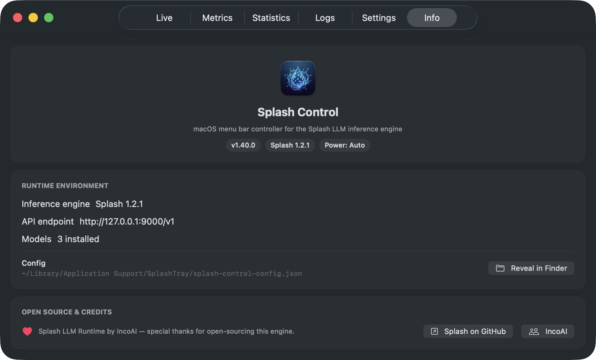

# Splash Control (SplashControl)

Native macOS menu-bar controller and real-time telemetry dashboard for the [Splash](https://github.com/incoai/splash) LLM inference engine.

<p align="center">
  
</p>

<p align="center">
  <strong>High-throughput local LLM monitoring, process management, and visual diagnostics for Apple Silicon.</strong>
</p>

<p align="center">
  
  
  
  
  <a href="https://github.com/vlewin/splash-control/releases/latest"></a>
  <a href="https://github.com/vlewin/splash-control/actions/workflows/pull-request.yml"></a>
  <a href="LICENSE"></a>
</p>

---

## Overview

**Splash Control** is a lightweight macOS menu-bar companion for [IncoAI's Splash](https://github.com/incoai/splash) runtime. It manages the local `splash serve` engine on `127.0.0.1:8000`, watches engine state via `/status`, switches models in one click, and shows a 6-tab telemetry dashboard.

Built with SwiftUI, AppKit, and Apple Charts. No external packages.

---

## The Dashboard

<p align="center">
  
</p>

---

## Key Features

### 🟢 Dual-Axis Status Indicator

The menu-bar item is a status light **and** a control surface:

- **Service State**: Clean indicators for server status (`up`, `starting`, `restarting`, `down`, `failed`).
- **Inference Phase**: Dynamic feedback distinguishing prefill/loading (`⚪️ blinking`), active token decoding (`🟢 blinking`), idle ready state (`⚪️ solid`), and engine pressure (`🟠 memory-capped / pressure`).
- **Real-Time Ticker**: Displays live generation rates (e.g. `24.5 tok/s`) directly in the macOS menu bar.

<p align="center">
  
</p>

### 🚀 Zero-Friction Process Management

- **Automatic Binary Resolution**: Finds the `splash` executable automatically across Apple Silicon (`/opt/homebrew/bin/splash`), Intel (`/usr/local/bin/splash`), `PATH`, or custom overrides.
- **Graceful Lifecycle**: Managed start, stop, SIGTERM escalation, port collision detection, and seamless adoption of externally started server processes.

### 📊 6-Tab Telemetry Dashboard

The dashboard window dynamically adjusts its height per tab to fit its components without awkward blank space.

<div style="display: flex; gap: 16px; flex-wrap: wrap;">
  <div style="flex: 1 1 46%; min-width: 300px;">
    
    <p align="center"><em>Four rolling series on a 15/30/60-min window. Drag any chart and all four scrub in sync.</em></p>
  </div>
  <div style="flex: 1 1 46%; min-width: 300px;">
    
    <p align="center"><em>Every control maps to a real <code>splash serve</code> flag.</em></p>
  </div>
</div>

<p align="center">
  
  <br />
  <em>Engine version, power mode, installed models, config location, and project links.</em>
</p>

<p align="center"><em>Live, Statistics (with a built-in benchmark), and Logs are in the app too. Try it.</em></p>

---

## Architectural Philosophy

- **Zero External Dependencies**: `Package.swift` contains zero external packages. Everything is built using macOS standard libraries (SwiftUI, AppKit, Combine, Charts, ServiceManagement).
- **Native Efficiency**: Negligible CPU footprint while idling; single HTTP status probe per interval with connection reuse.
- **Strict Layout Safety**: Built according to strict structural layout guidelines (three-column wing centering, non-wrapping numeric baselines, resilient frame constraints).
- **Privacy by Design**: All telemetry and logs remain 100% local on your machine. File paths displayed in the UI use standard tilde notation (`~/Library/Logs/...`) to protect user identity in shared screenshots.

---

## Requirements

- **Operating System**: macOS 26.4 or later on Apple M3+ (matches the Splash runtime's own floor).
- **Inference Runtime**: [Splash LLM Server](https://github.com/incoai/splash) installed via Homebrew:
  ```bash
  brew tap incoai/tap
  brew install splash
  ```

---

## Building & Installation

### Option 1: Build the Standalone App Bundle (Recommended)

To assemble and ad-hoc sign `dist/Splash.app`:

```bash
# Clone the repository
git clone https://github.com/vlewin/splash-control.git
cd splash-control

# Assemble Splash.app
make app

# Launch the app
open dist/Splash.app
```

You can move `dist/Splash.app` to your `/Applications` directory.

#### First launch: Gatekeeper

The bundle is ad-hoc signed and **not notarized**, so macOS Gatekeeper blocks
the first open with a "can't be opened because the developer cannot be verified"
warning. Dismiss it once, either:

- **Control-click (or right-click) `Splash.app` → Open → Open** in the dialog, or
- **System Settings → Privacy & Security** → find the blocked entry → **Open Anyway**.

This is a one-time action. From then on the app opens normally from wherever you
keep it.

### Option 2: Swift Package Manager (Development)

```bash
# Compile debug build
make build

# Run directly
swift run SplashControl
```

### Running Test Suites

Verify core metrics, formatters, and status derivation logic:

```bash
make check
```

---

## Client Integration

Splash Control serves an OpenAI-compatible API on `http://127.0.0.1:8000/v1`
for coding assistants and local LLM clients. One concept explains every
setup failure: **the server accepts a single model id, the one it loaded,
and nothing else.** A request naming anything else fails with
`model_not_found`, and switching models in the tray invalidates every client
config holding the old id.

Find the current id in the Live tab header, or ask the server:

```bash
curl http://127.0.0.1:8000/v1/models
```

### cURL Quick Test

The Live view has a `curl` button that copies a working request with the
right id already filled in. By hand it looks like this:

```bash
curl http://127.0.0.1:8000/v1/chat/completions \
  -H "Content-Type: application/json" \
  -d '{
    "model": "incoai/Qwen3.8-27B-Splash",
    "messages": [{"role": "user", "content": "Hello Splash!"}]
  }'
```
Replace the id with the one your server reports. Simplest of all for scripts:
omit `model` entirely — with a single model loaded, the server uses it
(verified against the live server).

### Pi Agent / OpenCode / Cline Configuration

These harnesses require a model name in their settings, so omission is not
an option:

- **Base URL**: `http://127.0.0.1:8000/v1`
- **API Key**: Any dummy string (e.g. `splash-local`) or configured key.
- **Model Name**: `default` — the stable alias the tray serves by default.
  It keeps working across model switches; change or clear it in
  Settings → Advanced.

---

## Credits & Acknowledgements

- **[IncoAI](https://github.com/incoai)** for creating and open-sourcing the high-performance [Splash LLM Runtime](https://github.com/incoai/splash).
- Built with ❤️ for the local AI engineering community on macOS.

---

## License

Copyright 2026 Vlad Lewin.

Licensed under the Apache License, Version 2.0. See [LICENSE](LICENSE) and [NOTICE](NOTICE).
Splash, the engine this app connects to, is a separate project by IncoAI, also under Apache-2.0.
